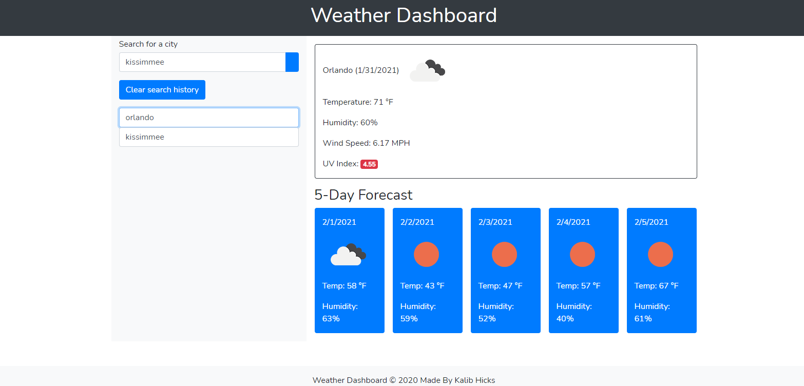

# Weather Dashboard
​
## Description 
​
Built with:
CSS
HTML
Javascript

- - -

This project served as a tool to implement the knowledge gained of javascript and web api from the recent lessons into a fully functional 
wep application that can dynamiccaly display different weather conditions for cities once they are searched.

​- - -

​Project link: https://kalib-hicks.github.io/weather-dashboard

## Usage

To navigate this web application, type a city name into the search bar and press the search button to the right of the entry box. If a valid city name is entered, the weather condition information will pop up also displaying a 5 day forecast. Different cities can be searched and the cities previously searched will be saved in the history. There is also a clear history function that will remove all of the past city searches. 

​
## Credits
​
bootstrap: https://stackpath.bootstrapcdn.com/bootstrap/4.4.1/css/bootstrap.min.css
icons: //code.ionicframework.com/ionicons/2.0.1/css/ionicons.min.css"
script source: https://unpkg.com/axios/dist/axios.min.js"
api: https://api.openweathermap.org/data/2.5/weather?q=
fonts: https://fonts.googleapis.com/css?family=Nunito
